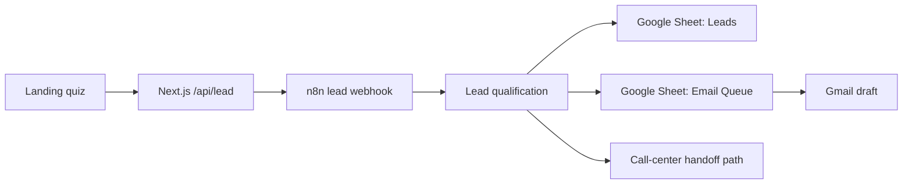

# NovaHaus Lead-to-Call Demo

Portfolio MVP for a real-estate lead funnel:



The project demonstrates a fast-response sales operations workflow: a quiz captures intent, the lead is qualified, CRM-like rows are created in Google Sheets, and a review-ready Gmail draft is prepared for follow-up.

## Administration

Operational notes for Vercel, DNS, n8n, Google Sheets, Gmail drafts, and production checks are in:

```text
docs/ADMIN_RUNBOOK.md
```

## Local Development

```bash
npm install
npm run dev
```

Open:

```text
http://localhost:3000
```

## Required Environment

Create `.env.local` from `.env.local.example` and set:

```bash
N8N_LEAD_WEBHOOK_URL=https://workflows.example.com/webhook/novahaus-lead
N8N_LEAD_WEBHOOK_SECRET=shared-secret
```

The same secret must be configured on the n8n instance.

## Demo Seed Leads

Run four portfolio demo scenarios:

```bash
npm run demo:leads
```

This sends:

- `hot`: ready for call-center handoff
- `warm`: needs a clarifying financing email
- `cold`: goes into nurture
- `not_qualified`: softly filtered because minimum equity is not met

Useful options:

```bash
npm run demo:leads -- --dry-run
npm run demo:leads -- --scenario=warm
DEMO_LEAD_TARGET_EMAIL=you@example.com npm run demo:leads
DEMO_LEAD_API_URL=https://your-site.example.com/api/lead npm run demo:leads
```

By default, demo leads use reserved `example.com` addresses and create Gmail drafts only. If auto-send is added later, use `DEMO_LEAD_TARGET_EMAIL` so demo emails can only go to a controlled inbox.

## AI Email Drafts

Static templates are the default safe mode:

```bash
AI_EMAIL_PROVIDER=template
```

Available providers:

```bash
AI_EMAIL_PROVIDER=template
AI_EMAIL_PROVIDER=gemini
AI_EMAIL_PROVIDER=openrouter
AI_EMAIL_PROVIDER=openrouter_auto_free
```

Use a fixed OpenRouter model:

```bash
AI_EMAIL_PROVIDER=openrouter
AI_EMAIL_MODEL=openrouter/free
OPENROUTER_API_KEY=your-key
```

Use the daily free-model switcher:

```bash
AI_EMAIL_PROVIDER=openrouter_auto_free
OPENROUTER_API_KEY=your-key
FREE_LLM_MODELS_URL=https://shir-man.com/api/free-llm/top-models
FREE_LLM_FALLBACK_MODEL=openrouter/free
```

Use Gemini:

```bash
AI_EMAIL_PROVIDER=gemini
AI_EMAIL_MODEL=gemini-3.5-flash
GEMINI_API_KEY=your-key
```

If the selected provider is not configured or returns invalid content, `/api/lead` falls back to the static draft so the pipeline still writes the lead, appends the email queue row, and creates a Gmail draft.

## n8n Workflow

The workflow files and setup notes are in:

```text
workflows/n8n/
```

Current workflow:

```text
Webhook -> Verify secret -> Normalize + qualify lead -> Append Leads row -> Route by segment -> Append Email Queue row -> Create Gmail Draft -> Respond OK
```

## Portfolio Notes

This is intentionally scoped as a portfolio/prototype system, not a production CRM:

- Gmail creates drafts for review, not automatic outreach by default.
- The call-center step is represented as a structured handoff path.
- AI-generated email drafts are supported through `AI_EMAIL_PROVIDER=gemini`, `openrouter`, or `openrouter_auto_free`; guarded demo auto-send can be added later.
