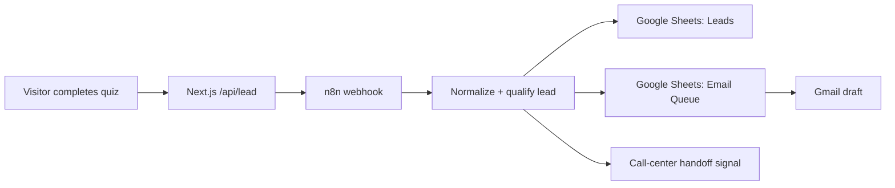

# NovaHaus Admin Runbook

This runbook explains how to operate the NovaHaus lead-to-call demo safely.

## Live Services

| Area | Service | URL |
| --- | --- | --- |
| Public site | Vercel | https://novahaus.valquilty.com |
| Backup site URL | Vercel | https://novahaus-lead-quiz.vercel.app |
| Workflow automation | n8n | https://workflows.valquilty.com |
| Workflow name | n8n | NovaHaus Lead Collector - MVP |
| Lead storage | Google Sheets | Leads tab |
| Internal Lead Inbox | Next.js + Postgres | https://novahaus.valquilty.com/admin/leads |
| Email review | Gmail | Drafts |

## Data Flow



## Daily Operations

1. Check n8n executions for failures.
2. Check the Google Sheet `Leads` tab for new leads.
3. Check the Google Sheet `Email Queue` tab for the email draft status.
4. Review Gmail drafts before sending anything.
5. For hot leads, call or hand off to a manager within 5-15 minutes.

## Lead Segments

| Segment | Meaning | Default action |
| --- | --- | --- |
| `hot` | Buyer looks ready and has strong buying signals | Call-center handoff and draft follow-up |
| `warm` | Buyer is active but financing/timing needs clarification | AI-generated clarifying email draft |
| `cold` | Buyer is researching or not ready yet | Nurture draft |
| `not_qualified` | Minimum capital signal is missing | Soft disqualification or financing-options draft |

## Vercel Deployment

Current deployment mode is GitHub auto-deploy:

```text
GitHub repo: https://github.com/QuiltyVal/novahaus-lead-quiz
Production branch: main
Vercel project: novahaus-lead-quiz
```

Every push to `main` should create a production deployment.

Manual fallback:

```bash
vercel --prod
```

Required production environment variables live in Vercel, not in GitHub:

```text
DATABASE_URL
ADMIN_USERNAME
ADMIN_PASSWORD
N8N_LEAD_WEBHOOK_URL
N8N_LEAD_WEBHOOK_SECRET
AI_EMAIL_PROVIDER
OPENROUTER_API_KEY
OPENROUTER_BASE_URL
OPENROUTER_APP_NAME
FREE_LLM_MODELS_URL
FREE_LLM_FALLBACK_MODEL
NEXT_PUBLIC_GTM_ID
NEXT_PUBLIC_META_PIXEL_ID
META_ACCESS_TOKEN
META_TEST_EVENT_CODE
NEXT_PUBLIC_CONTACT_EMAIL
NEXT_PUBLIC_CALENDLY_URL
NEXT_PUBLIC_LINKEDIN_URL
```

Never commit `.env.local`.

## Internal Lead Inbox

The project now has a prepared admin inbox at:

```text
/admin/leads
```

It is protected with HTTP Basic Auth in production. Set:

```text
ADMIN_USERNAME
ADMIN_PASSWORD
DATABASE_URL
```

Database setup:

1. Create a Postgres database.
2. Run `db/schema.sql` once.
3. Add `DATABASE_URL` in Vercel.
4. Redeploy.

If `DATABASE_URL` is not set, the public funnel still works through n8n/Google Sheets and `/admin/leads` shows a setup state.

## Marketing Trackers

The site has consent-gated slots for:

| Tracker | Env var | Where it runs |
| --- | --- | --- |
| Google Tag Manager | `NEXT_PUBLIC_GTM_ID` | Browser, after marketing consent |
| Meta Pixel | `NEXT_PUBLIC_META_PIXEL_ID` | Browser, after marketing consent |
| Meta Conversions API | `META_ACCESS_TOKEN` | Server-side `/api/capi`, after consent-triggered events |

To enable trackers:

1. Add the env vars in Vercel `Settings -> Environment Variables`.
2. Keep secrets out of `NEXT_PUBLIC_*`; those values are visible in the browser.
3. Redeploy production after changing env vars.
4. Test with one quiz submission and verify GTM Preview / Meta Events Manager.

## GitHub Auto-Deploy

The Vercel project is connected to:

```text
QuiltyVal/novahaus-lead-quiz
```

If auto-deploy stops working:

1. Open the Vercel project `novahaus-lead-quiz`.
2. Go to `Settings -> Git`.
3. Confirm repository is `QuiltyVal/novahaus-lead-quiz`.
4. Confirm production branch is `main`.
5. Confirm GitHub Actions/secrets are not required for normal Vercel Git deploys.

## DNS

Cloudflare DNS for the public site:

```text
Type: A
Name: novahaus
Value: 76.76.21.21
Proxy status: DNS only
TTL: Auto
```

Keep `workflows.valquilty.com` separate for n8n.

## n8n Checks

Open `https://workflows.valquilty.com` and inspect:

- workflow is published
- Gmail OAuth credential is connected
- Google Sheets credential is connected
- latest execution succeeds after a quiz submission
- failed executions are investigated before changing prompts or env vars

## Test A Production Lead

Send one warm demo lead to production:

```bash
DEMO_LEAD_API_URL=https://novahaus.valquilty.com/api/lead npm run demo:leads -- --scenario=warm
```

Expected result:

- CLI returns `status: ok`
- lead appears in Google Sheets
- email queue row is appended
- Gmail draft appears
- n8n execution is successful

## AI Email Provider

Default portfolio setting:

```text
AI_EMAIL_PROVIDER=openrouter_auto_free
```

Fallback behavior:

- if OpenRouter fails, the app uses static templates
- if free-model lookup fails, the app uses `FREE_LLM_FALLBACK_MODEL`
- if n8n fails, `/api/lead` returns a visible error so the workflow can be debugged

For real client work, keep Gmail in draft-only mode until legal/commercial review is complete.

## Emergency Fallback

If AI drafts fail:

```text
AI_EMAIL_PROVIDER=template
```

If n8n fails:

1. Check n8n execution logs.
2. Check `N8N_LEAD_WEBHOOK_URL`.
3. Check `N8N_LEAD_WEBHOOK_SECRET` on both Vercel and n8n.
4. Run the production demo lead command again.

If the public domain fails:

1. Test `https://novahaus-lead-quiz.vercel.app`.
2. Check Cloudflare `novahaus` A record.
3. Check Vercel domain configuration.

## Safety Rules

- Do not auto-send emails in the demo.
- Do not expose API keys in `NEXT_PUBLIC_*` variables.
- Do not commit `.env.local`.
- Do not merge production changes without `npm run build`.
- Do not treat Google Sheets as a production CRM for real client operations.
